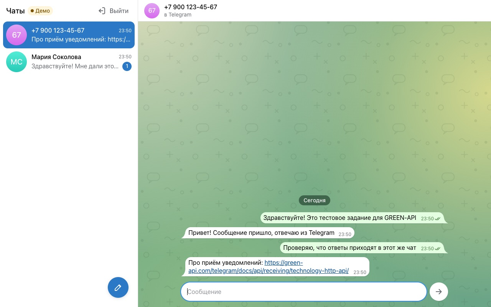
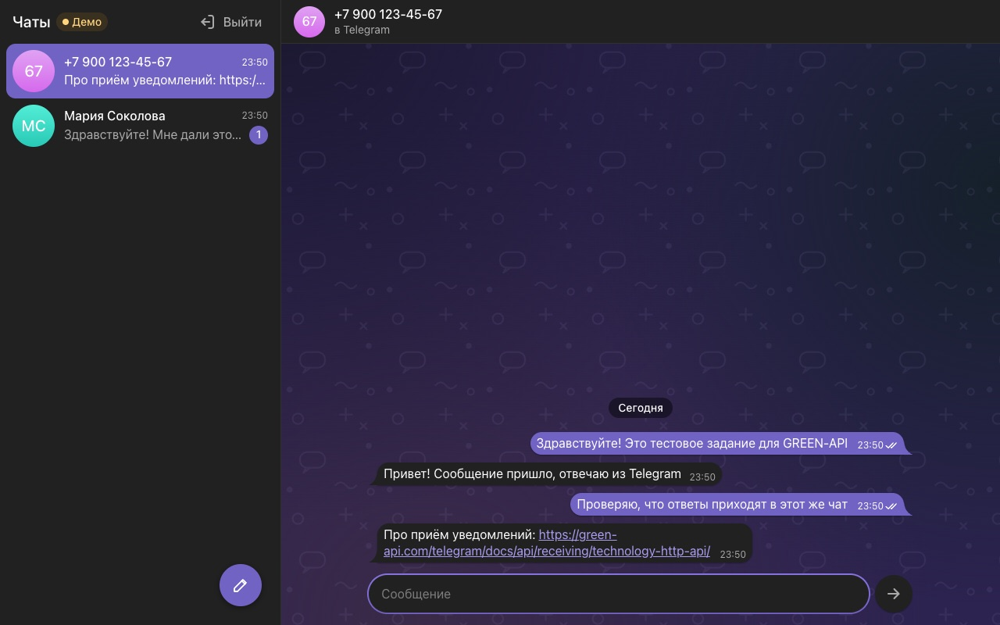
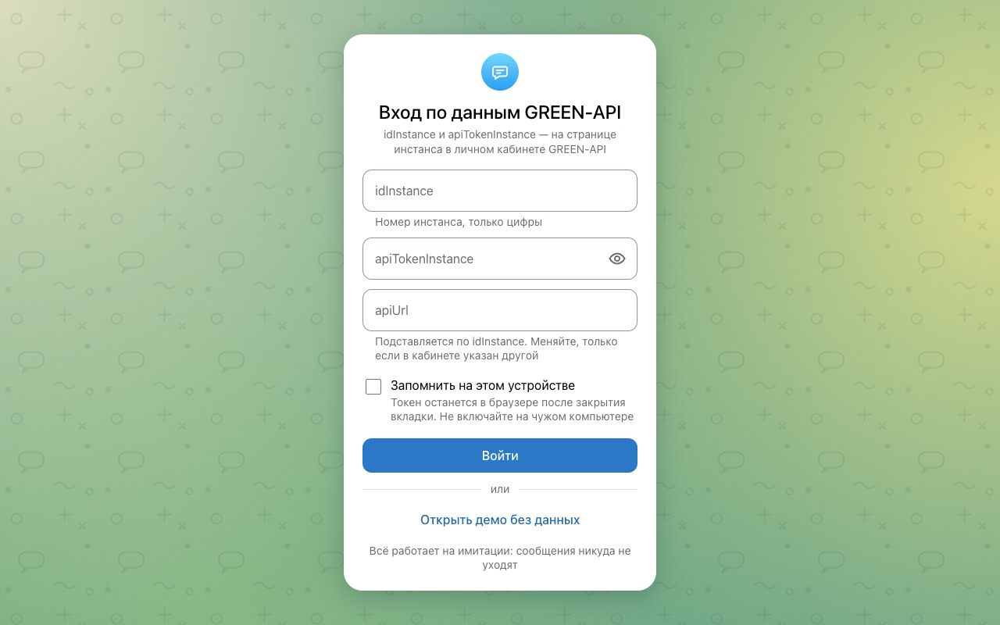
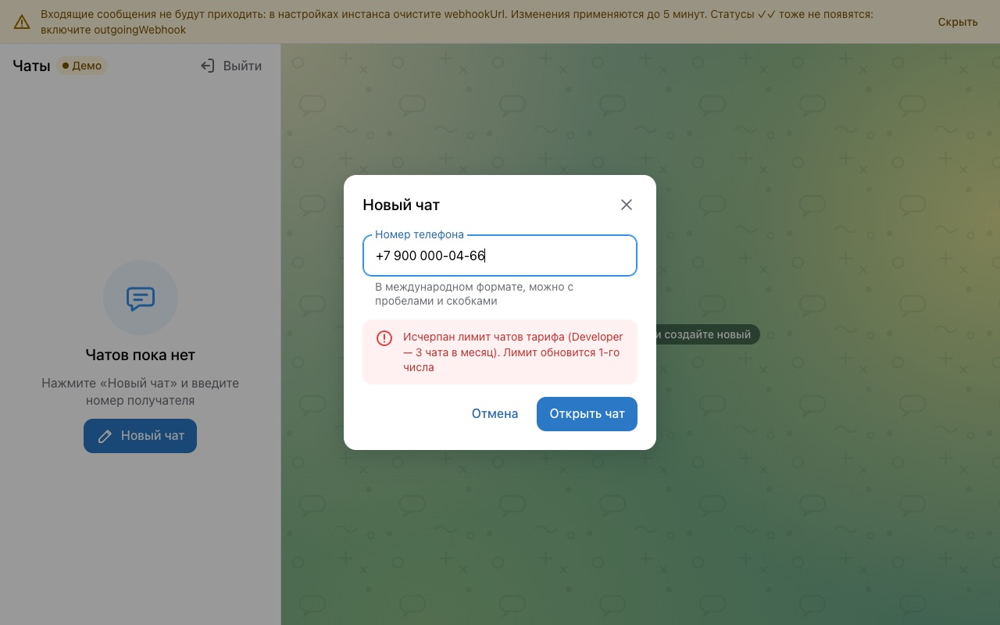
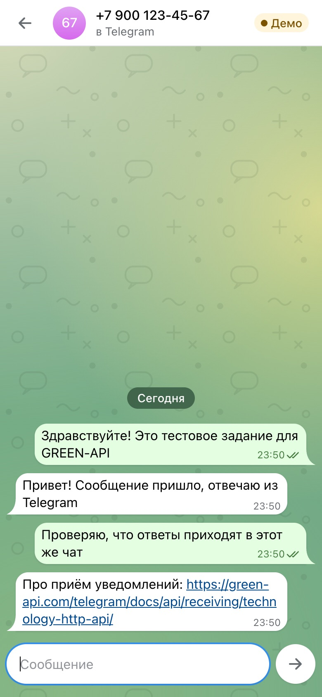
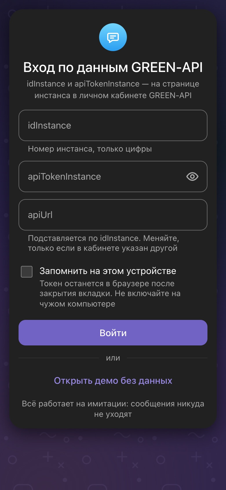

# Telegram-чат через GREEN-API

Тестовое задание в GREEN-API: веб-чат в духе web.telegram.org. Вводите данные своего инстанса, открываете чат
по номеру телефона, пишете — ответ собеседника приходит в тот же чат.

Демо: https://valary.github.io/green_api/?demo — без ключей, запросы перехватывает MSW прямо в браузере.

|                                                    |                                                                                          |
| -------------------------------------------------- | ---------------------------------------------------------------------------------------- |
|       |                                            |
|           |  |
|  |                  |

## Как запустить

Нужен Node.js 24 (`.nvmrc`), на 22 и 26 тоже работает.

```bash
git clone git@github.com:valary/green_api.git
cd green_api
nvm use
npm ci
npm run dev          # http://localhost:5173
```

Без ключей — кнопка «Открыть демо без данных». Номер на `…0000` «не находится» в Telegram, на `…0466` упирается в лимит тарифа.
Сценарии ошибок: `/?demo=settings` (задан webhookUrl), `/?demo=offline` (через 5 с пропадает сеть на 20 с),
`/?demo=sendError` (первая отправка падает), `/?demo=newChat` (пишет незнакомый человек).

Со своим инстансом: idInstance и apiTokenInstance берутся в [личном кабинете](https://console.green-api.com), apiUrl
подставится сам по первым четырём цифрам (`1101000001` → `https://1101.api.green-api.com`). Если инстанс не подключён
к Telegram, приложение так и скажет — подключите аккаунт по QR (Telegram → Настройки → Устройства → Подключить устройство)
и подождите статус `authorized`, обычно пару минут. Чтобы входящие приходили, в настройках инстанса нужны
пустой `webhookUrl`, `incomingWebhook: yes` и `outgoingWebhook: yes` (иначе не будет ✓✓) — приложение проверит и подскажет.

На тарифе Developer 3 чата в месяц. Не пишите на `номер@c.us` — для Telegram это второй чат в квоту,
и не держите второй опросчик очереди (скрипт, вебхук): он будет забирать ответы.

```bash
npm test                          # Vitest + Testing Library + MSW
npm run lint
npm run build && npm run preview  # продакшен-сборка на http://localhost:4173
npm run check                     # всё сразу, как в CI
```

## Что решила и почему

Стек привычный: React + TypeScript, Redux Toolkit, axios, react-hook-form + yup, styled-components, MSW.
Структура как в моих рабочих проектах: `app/` (api, store со слайсами session/connection/chat, роутер), `components/`,
`pages/`, `shared/ui`, `shared/utils`, тексты интерфейса в `shared/constants/texts.ts`, типы по доменам в `types/`, моки в `mocks/`.
Компоненты тонкие — только разметка; формы, отправка, демо и выход живут в хуках `hooks/` и тестируются через `renderHook`.

Чат открываю только через `checkAccount`: Telegram отвечает числовым chatId, и дальше отправка и сопоставление ответов
идут по нему. Вариант с `номер@c.us` из примеров для WhatsApp здесь не работает — ответ просто не находит свой чат.

Приём — long polling, потому что сервера у меня нет. Цикл строго последовательный: receive → разбор → delete → следующий
receive, delete для каждого уведомления, даже непонятного, иначе очередь встанет. При обрыве сети пауза растёт до 30 с,
на 401/403 цикл останавливается, на постоянные 4xx показывает баннер. Две вкладки делили бы одну очередь, поэтому
опросчик держит Web Lock на инстанс, вторая вкладка ждёт своей очереди.

Уведомления бывают дублями, а эхо своей отправки и статусы иногда обгоняют ответ `sendMessage`. Редьюсеры дедуплицируют
по idMessage и склеивают эхо с отправленным сообщением — это чистые функции, на них тесты.

Токен у GREEN-API часть пути, поэтому URL собирается только в интерцепторе axios. В сторе токена нет, в адрес страницы
он не попадает, без «Запомнить» живёт в sessionStorage. Обойти нельзя одно: упавший запрос браузер сам пишет в консоль
вместе с URL — скриншотами Network и Console лучше не делиться.

MSW-хендлеры общие для тестов и демо, и очередь в них ведёт себя как настоящая: без delete следующее уведомление не отдаётся.
Сначала хотела подменять ответы прямо в клиенте, но тогда демо не проверяло бы сам клиент и цикл приёма.

## Что бы улучшила

- Небольшой бэкенд: вебхук GREEN-API → WebSocket в браузер. Уйдёт long polling, и токен перестанет жить в браузере.
- Историю через `getChatHistory` при открытии чата и виртуализацию длинной ленты.
- e2e на Playwright поверх демо-режима и axe в CI.
- i18n — тексты ошибок уже собраны в одном месте.

## Деплой

GitHub Pages через Actions: Settings → Pages → Source: GitHub Actions, потом Actions → Deploy to GitHub Pages → Run workflow.
Base берётся из имени репозитория (`/green_api/`), в сборку добавляются CSP-мета и `404.html` для прямых ссылок на чат.
Локально то же: `VITE_BASE=/green_api/ npm run build && npx vite preview --base /green_api/`.
